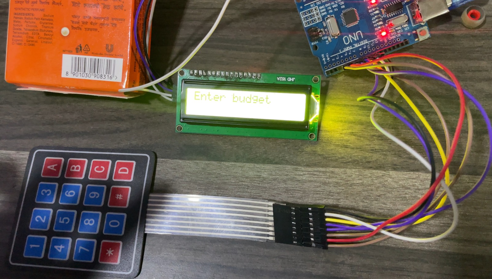

# 🛒 Trolley Budget Scanner

The **Trolley Budget Scanner** is an innovative solution designed to streamline the shopping experience by automatically tracking the total cost of items in a trolley in real-time.  

In today's fast-paced world , shoppers often face the inconvenience of manually calculating their purchases, leading to unexpected totals, overspending, or wasted time. This project addresses this problem by integrating a smart scanning system into shopping trolleys that scans barcodes as items are added, providing a running total of the expenditure.

---

## 🚀 Features
- Real-time tracking of total cost while shopping
- Automatic barcode scanning for items
- Budget limit notifications
- Reduced checkout time and errors
- User-friendly interface for enhanced convenience

---

## 🖥️ How It Works
1. Items are placed in the trolley.  
2. The barcode scanner reads each item.  
3. The system calculates and displays the running total.  
4. Alerts the user if the budget limit is exceeded.  

---

## 📸 Image

---

## 📂 How to Run
1. Ensure all hardware/software dependencies are set up.  
2. Connect the barcode scanner to the system.  
3. Launch the Trolley Budget Scanner application.  
4. Add items to the trolley and watch the total update in real-time.

---

## 📌 Notes
- Designed for retail environments to reduce human error.  
- Helps manage shopping budgets efficiently.  
- Can be extended to include mobile notifications or cloud syncing.

---

## 👨‍💻 Authors
- **Sujal Patil** – [GitHub](https://github.com/SujalPatil21)  
- **Shreya Awari** – [GitHub](https://github.com/shreyaawari28)  
- **Tejas Halvankar** – [GitHub](https://github.com/Tejas-H01)

---

*Developed as a smart retail technology solution to improve shopping efficiency and customer satisfaction.*
