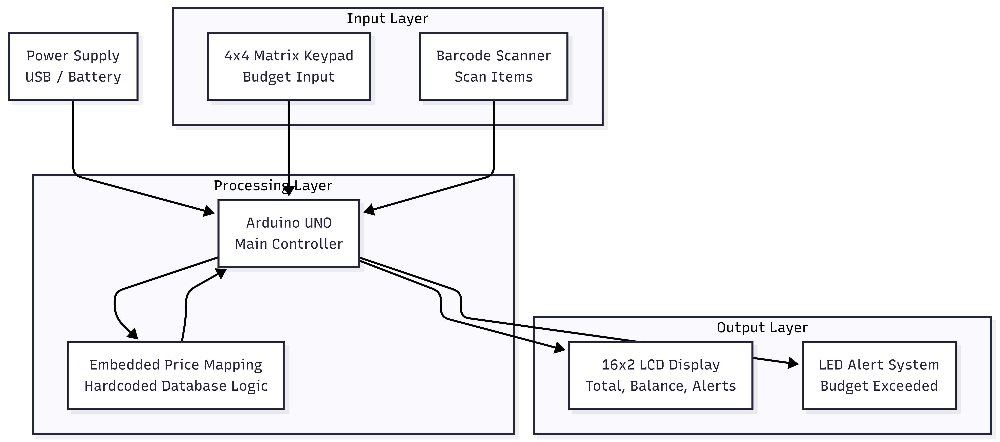

# Trolley Budget Scanner

Trolley Budget Scanner is an embedded system designed to streamline the shopping experience by automatically tracking the total cost of items in a trolley in real time.

In traditional shopping environments, customers often rely on manual calculations or wait until checkout to see the total cost. This frequently leads to overspending, miscalculations, and checkout delays. The Trolley Budget Scanner solves this problem by integrating a barcode scanner, Arduino UNO, LCD display, keypad, and LED alert system to provide live expense tracking with budget notifications.

---

## Problem Statement

Most shopping systems do not provide real-time expense monitoring. Customers:

- Estimate costs manually  
- Use mobile calculators  
- Discover overspending only at checkout  
- Lack a predefined budget alert mechanism  

This results in inconvenience, time loss, and financial mismanagement.

---

## Proposed Solution

The Trolley Budget Scanner provides:

- Real-time expense tracking  
- Predefined budget setting  
- Automatic barcode scanning  
- Live total and remaining balance display  
- LED alert when budget is exceeded  
- Item removal functionality  

The system operates fully offline using embedded logic within the Arduino UNO.

---

## System Architecture

The system follows a hardware-based layered architecture consisting of input devices, a processing unit, embedded price mapping logic, and output devices.

### Architecture Diagram

---

### Architecture Overview

**Input Layer**
- 4x4 Matrix Keypad for budget entry and item removal  
- Barcode Scanner for scanning product barcodes  

**Processing Layer**
- Arduino UNO as the main controller  
- Embedded price mapping logic (offline database using conditionals/arrays)  

**Output Layer**
- 16x2 LCD Display showing:
  - Scanned item price  
  - Total cost  
  - Remaining budget  
- LED Alert System triggered when budget limit is exceeded  

**Power Layer**
- USB or external battery power supply  
- Fully offline standalone operation  

---

## Features

- Real-time tracking of total cost  
- Automatic barcode scanning  
- Budget limit notifications  
- Item removal functionality  
- Reduced checkout time  
- User-friendly hardware interface  
- Fully offline embedded system  

---

## How It Works

1. The user powers on the system.  
2. The user sets a predefined budget using the keypad.  
3. Items are scanned using the barcode scanner.  
4. The system retrieves the mapped price.  
5. The total is updated and displayed on the LCD.  
6. If the budget is exceeded, the LED alert is triggered.  
7. The user may remove items using removal mode.  
8. Final total is visible before checkout.  

---

## Hardware Components

- Arduino UNO  
- Barcode Scanner Module  
- 16x2 LCD Display  
- 4x4 Matrix Keypad  
- LED Alert System  
- Breadboard and Jumper Wires  
- Power Supply  

---

## Software Components

- Arduino IDE  
- Embedded C / Arduino C  
- Serial Communication Libraries  
- Hardcoded price mapping logic  

---

## Files Included

- Arduino_code.ino  
- Python_code.py  
- Blackbook_Final.pdf  
- Product.png  
- architecture.png  

---

## Applications

- Supermarkets and grocery stores  
- Retail shopping environments  
- College campus stores  
- Smart trolley research prototypes  
- Embedded systems academic projects  

---

## Future Scope

- External memory integration (EEPROM / SD Card)  
- Wireless communication (Wi-Fi / Bluetooth)  
- Mobile application integration  
- Cloud-based synchronization  
- Upgraded display (OLED or app interface)  
- Rechargeable battery support  

---

## Conclusion

The Trolley Budget Scanner demonstrates how embedded systems can solve real-world problems through automation and real-time data processing. By combining hardware components with embedded logic, the system enables budget-conscious shopping, reduces checkout delays, and enhances financial awareness.

---

## Authors

Sujal Patil – https://github.com/SujalPatil21  
Shreya Awari – https://github.com/shreyaawari28  
Tejas Halvankar – https://github.com/Tejas-H01  
